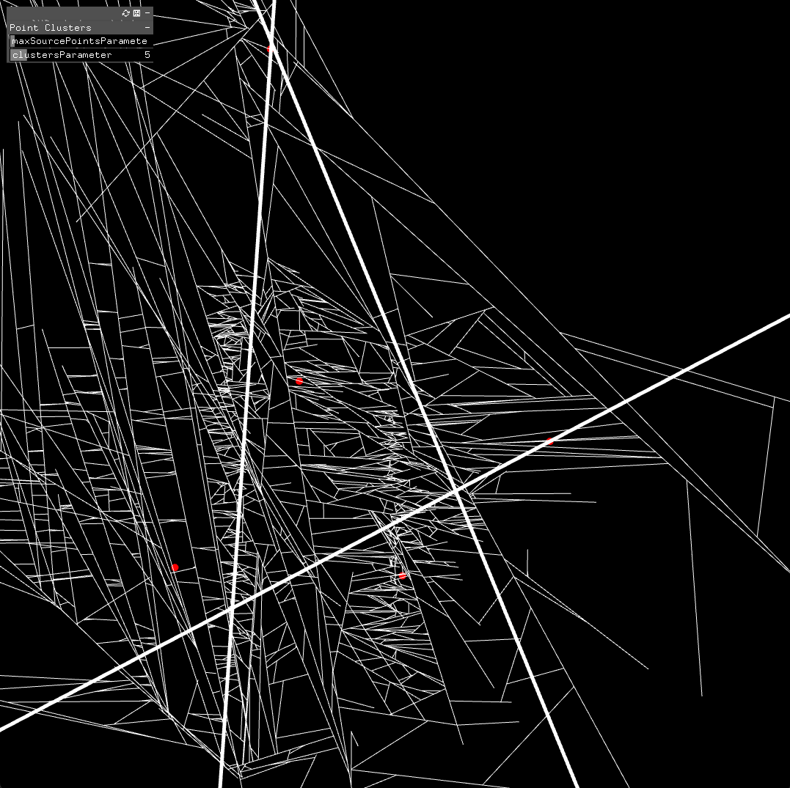

ofxPointClusters
================

2D point clustering using k-means.

Introduction
------------
A simple 2D point clustering addon based on k-means (see below).
Uses ofThread to offload analysis from the main thread.

Uses DKM k-means clustering library from https://github.com/genbattle/dkm under the
MIT License in dkm-LICENSE.md from https://github.com/genbattle/dkm/blob/master/LICENSE.md

The Red dots in the screenshot are clusters found from audio data.

License
-------
ofxPointClusters is distributed under the [MIT License](https://en.wikipedia.org/wiki/MIT_License). See the [LICENSE](LICENSE.md) file for further details. Just add my name somewhere along your project [Steve Meyfroidt](https://meyfroidt.com) whenever possible.

Dependencies
------------
DKM k-means header library from https://github.com/genbattle/dkm is included.

Compatibility
------------
Developed against OpenFrameworks 0.12+.
